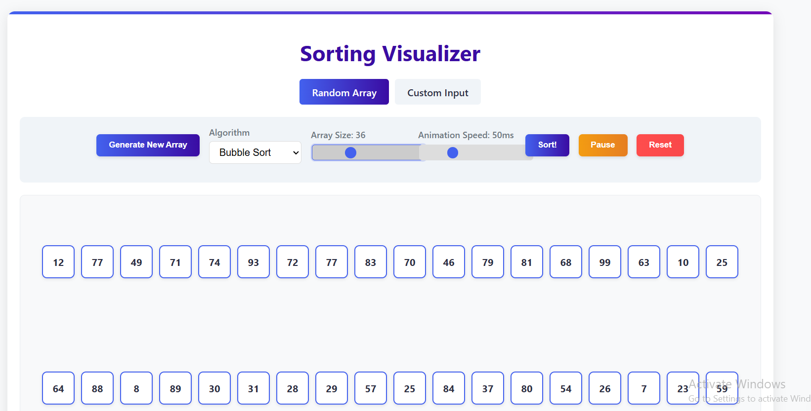
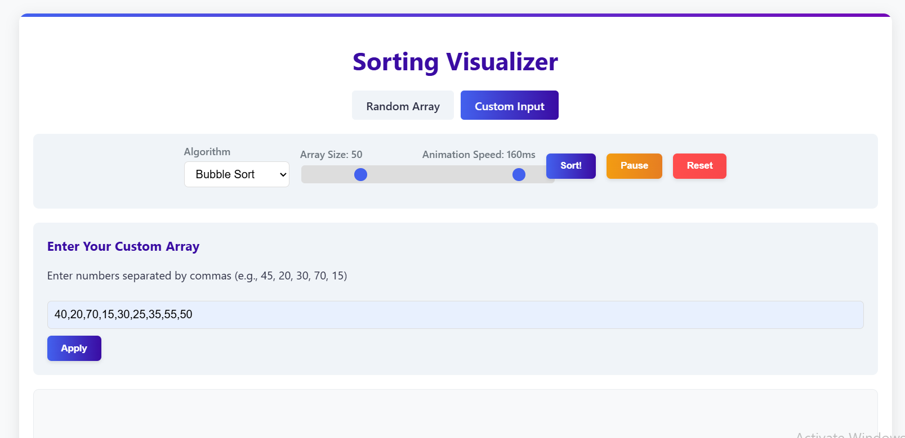

# 🧠 SortLogic – Interactive Sorting Visualizer

Welcome to **SortLogic**, an intuitive, educational, and visually appealing web-based sorting algorithm visualizer. Built for learners and enthusiasts, it showcases how popular sorting algorithms work step-by-step using animated number boxes and real-time logs.

🔗 **Live Demo**: [https://sortlogic.netlify.app](https://sortlogic.netlify.app)

---

## 📌 Features

- 🎲 **Random or Custom Input** – Visualize pre-generated random arrays or enter your own.
- 🧠 **Algorithms Supported**:
  - Bubble Sort
  - Selection Sort
  - Insertion Sort
  - Merge Sort
  - Quick Sort
- 🎨 **Box-Based Animation** – Replaces traditional bar visuals with interactive number boxes.
- ⚙️ **Controls**:
  - Adjustable Array Size
  - Speed Control Slider
  - Sort, Pause/Resume, and Reset
- 📊 **Live Stats**:
  - Comparisons Counter
  - Swap Counter
  - Execution Time
- 📝 **Text Log** – Displays step-by-step explanation of each action.
- 📚 **Algorithm Info Panel** – Time complexities (Best, Avg, Worst) with detailed explanations.
- 📱 **Responsive UI** – Works smoothly across devices (desktop/mobile/tablet).

---

## 🛠️ Built With

- **HTML5**
- **CSS3 (Responsive Flexbox Layout)**
- **Vanilla JavaScript (ES6)**

---

## 📷 Screenshots

| Random Input | User Input |
|------|---------|
|  |  |

---

## 🚀 Getting Started

To run this project locally:

1. **Clone the repository**  
   ```bash
   git clone https://github.com/YOUR_USERNAME/sortlogic.git
   cd sortlogic

2.Launch in browser
Open index.html in your preferred browser.

📁 Folder Structure
 📦 sortlogic/
 
  ┣ 📜 index.html
 
  ┣ 📜 style.css
 
  ┣ 📜 script.js
 
  ┗ 📂 assets/ (optional - for images, logos, etc.)


🌟 Future Enhancements
   • Add more sorting algorithms (Heap Sort, Shell Sort, etc.)

   • Code snippet view for each algorithm

   • Audio explanations per step

   • Light/Dark theme toggle

   • Export sorting as animation (GIF or video)

📨 Feedback
Found a bug or want to suggest a feature? Feel free to open an issue or connect via the live site.


